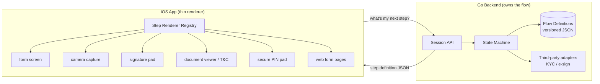
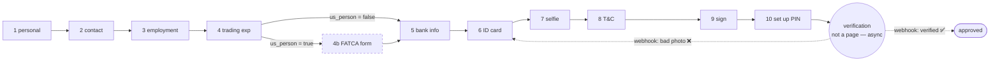
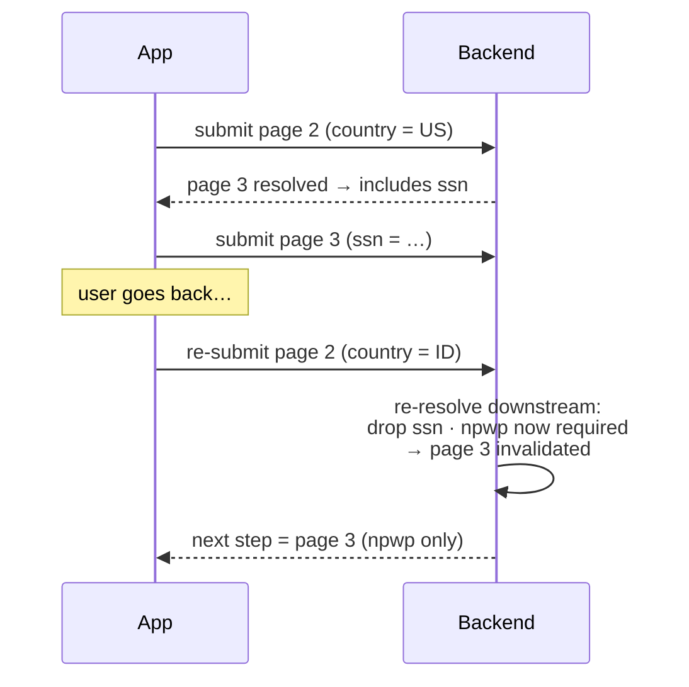
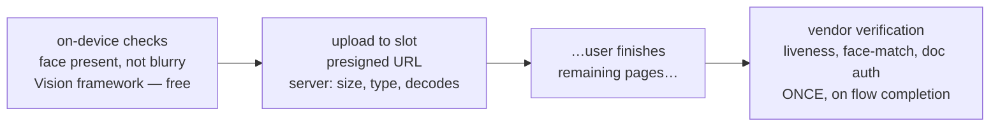
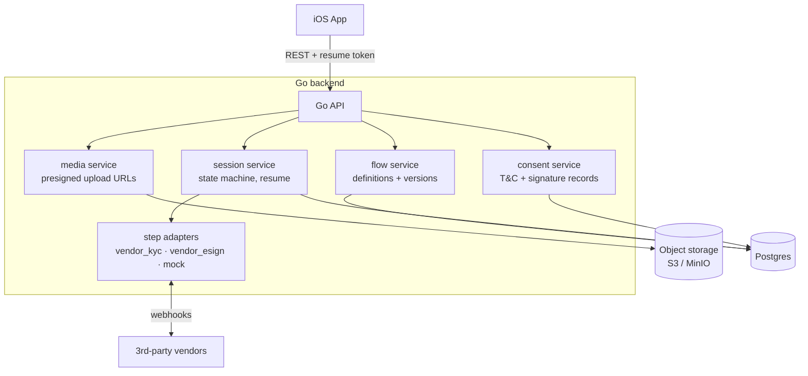
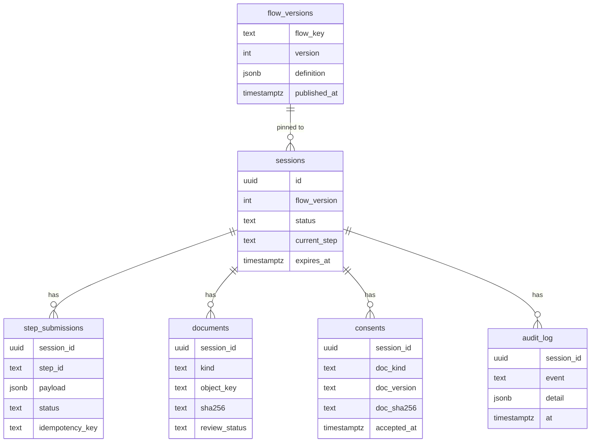
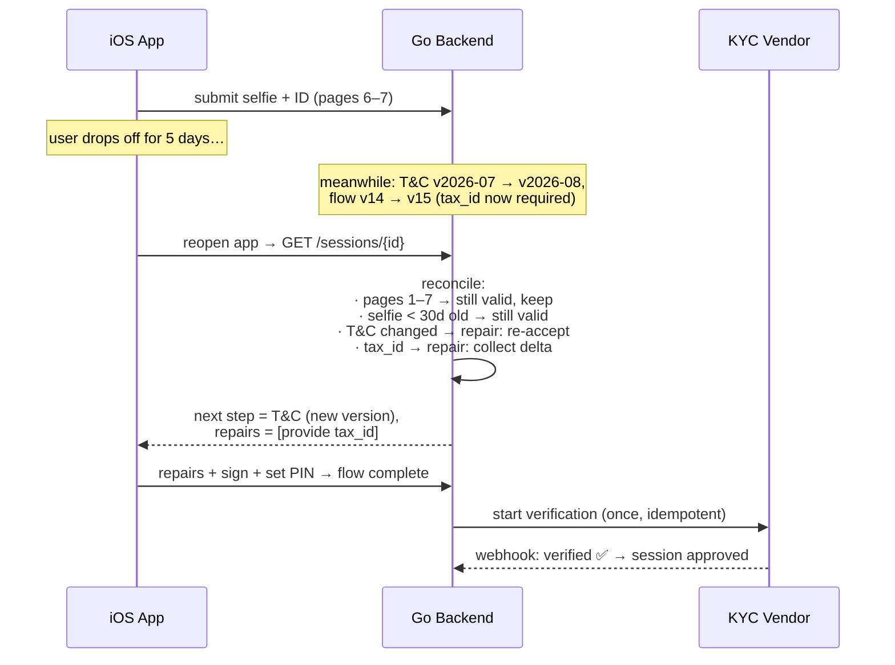

# Adaptive Registration Form — POC Plan

**Context:** trading-app onboarding (selfie, ID photo, personal + bank details, e-signature, T&C) on iOS, with a Go backend and Postgres.

**Problem:** these forms change constantly (regulatory fields, new T&C versions, page reordering, third-party KYC steps) and users drop off mid-flow. Shipping an app release for every change doesn't scale.

---

## 1. Core idea: the server drives the form

The iOS app is a **thin renderer**. It never knows the flow — it only knows how to render a small set of **step types**. The backend owns the flow definition, the ordering, the validation, and the state machine. Changing a field, reordering pages, or inserting a third-party step is a **data change in Postgres, not an app release**.



The contract between app and backend is: *"here is the user's answer to step X"* → *"here is step Y, render it."* The client **never decides ordering**.

The app ships with renderers for each step `type` (`form`, `camera`, `signature`, `document`, `pin`, `external`). New *step types* need an app release; new *steps, fields, pages, or orderings* do not. There is deliberately **no unknown-type fallback**: capability negotiation (below) means the server never serves a step type the client didn't declare support for — an outdated client gets `force_update`, never a guess.

### Native vs WebView — a per-step decision, not a fork

What actually requires an app release in the native approach is small: a **never-before-seen component type** (built once, reused forever) and **visual redesign**. A new checkbox, field, page, or banner instance is data. Still, webview is tempting for design velocity — honest comparison:

**Decision: hybrid (updated once Android became a requirement).** With iOS *and* Android, every native component type is built twice and shipped through two app-store release trains — while a web form page is built once and reaches both platforms instantly. That flips the form pages to web; the trust-critical steps stay native on both platforms.

| Step | Verdict | Why |
|---|---|---|
| Camera (selfie / ID) | native ×2 | AVFoundation/CameraX control, on-device quality checks (what makes deferred verification safe), vendor liveness SDKs are native on both |
| Signature, PIN | native ×2 | PIN pad must be native (Keychain / Android Keystore); native signature pad feels better |
| Form pages, T&C, banners | **web, inside the app** | 6 of 10 pages built once for both platforms; new field kinds, banners, and visual changes ship server-side with zero app releases |
| Third-party vendor steps | webview | vendor-hosted processes (e.g. e-sign) render at the vendor's URL |

The web security tax is now accepted because it buys cross-platform reuse — but it's a standing discipline, not a one-time setup: strict CSP with **zero third-party scripts** on registration pages, XSS review on frontend changes, npm dependency patching, and a hardened native↔web token handoff (short-lived, session-scoped token injected by the shell; nothing stored in web storage). Fallback if there's no web engineering capacity: native ×2 is still viable (the renderers are thin), at the cost of double builds per new component type.

**Version skew (matters either way):** with two app stores, old app versions linger. The client declares its capabilities when opening a session (`supported_types`, `supported_field_kinds`); the server only serves flow versions the client can render, and returns a `force_update` step when it can't. New native component types roll out safely: publish the flow version that uses them only after both apps ship.

---

## 2. Flow definition (the extensibility core)

Flows are versioned JSON documents stored in Postgres. A session is **pinned to the flow version it started on**, so an in-flight user is never broken by a mid-flight definition change.

```jsonc
{
  "flow": "retail_onboarding",
  "version": 14,
  "steps": [
    { "id": "personal_details", "type": "form",
      "fields": [
        { "key": "full_name", "kind": "text", "required": true },
        { "key": "dob", "kind": "date", "rules": ["age>=18"] },
        { "key": "tax_id", "kind": "text", "since_version": 14 }   // ← new regulatory field
      ]},
    { "id": "id_card",   "type": "camera",    "capture": "id_card" },
    { "id": "selfie",    "type": "camera",    "capture": "selfie" },
    { "id": "bank_info", "type": "form",      "fields": [ /* ... */ ] },
    { "id": "tnc",       "type": "document",  "doc": "tnc" },   // active doc version resolved at serve time (§4.1)
    { "id": "sign",      "type": "signature" },
    { "id": "setup_pin", "type": "pin" }       // last page — credential goes to auth service, never into step storage
  ],
  "on_complete": [
    { "adapter": "vendor_kyc" }   // NOT a page — expensive verification runs once, after the flow is done
  ]
}
```

- **Add a field / change T&C** → publish version 15. New sessions get it; in-flight sessions are reconciled on resume (§4).
- **Reorder pages** → edit the `steps` array.
- **Insert a third-party step** → add a step with `type: external` pointing at an adapter.

---

## 2.1 Worked example: the full 10-page flow

A realistic trading-app onboarding with five form pages plus the special pages:

| # | Page | `type` | iOS renderer |
|---|---|---|---|
| 1 | Personal details | `form` | form screen |
| 2 | Contact & address | `form` | form screen |
| 3 | Employment & income | `form` | form screen |
| 4 | Trading experience (suitability) | `form` | form screen |
| 5 | Bank information | `form` | form screen |
| 6 | Identity card photo | `camera` | camera capture |
| 7 | Selfie | `camera` | camera capture |
| 8 | Terms & conditions | `document` | document viewer |
| 9 | E-signature | `signature` | signature pad |
| 10 | Set up PIN | `pin` | secure PIN pad |

KYC verification is deliberately **not** in this table — it's not a page. It's an `on_complete` process the state machine triggers after page 10, surfaced to the user only as a pending/approved status.

**Ten pages, six renderers — that's the whole point.** Pages 1–5 are all the same `form` type: one SwiftUI screen, one submit endpoint, one storage shape. The engine just walks the `steps` array; nothing in Go or Swift knows whether the flow has 5 pages or 25. Going from 10 to 15 pages is a JSON edit.



### What the form pages need (and camera/signature pages don't)

Five form-heavy pages means the field schema has to carry the complexity, so it lives in data:

```jsonc
{ "id": "employment_income", "type": "form", "title": "Employment & income",
  "fields": [
    { "key": "employment_status", "kind": "select", "options_ref": "employment_statuses", "required": true },
    { "key": "employer_name",     "kind": "text",
      "visible_when":  "employment_status in ['employed','self_employed']",
      "required_when": "employment_status in ['employed','self_employed']" },
    { "key": "annual_income",     "kind": "money",  "rules": ["min:0"] },
    { "key": "source_of_funds",   "kind": "multiselect", "options_ref": "fund_sources" },
    { "key": "us_person",         "kind": "bool", "required": true }   // drives the FATCA branch
  ]}
```

- **`visible_when` / `required_when`** — field-level conditionality, evaluated on both sides (client for UX, server for truth).
- **`options_ref`** — dropdown contents (countries, employment statuses) come from a reference-data endpoint, so option lists update without touching the flow.
- **Page branching** — transitions can insert pages based on earlier answers (`us_person → FATCA`). The server evaluates this; the client just renders whatever comes next.

### Cross-page dependencies (page 3 depends on page 2)

Conditions may reference **any earlier page** via `answers.<page>.<field>`:

```jsonc
{ "id": "employment_income", "type": "form",   // page 3
  "fields": [
    { "key": "ssn",  "kind": "text", "visible_when": "answers.contact_address.country == 'US'"  },
    { "key": "npwp", "kind": "text", "visible_when": "answers.contact_address.country == 'ID'"  }
  ]}
```

Three rules make this work:

1. **Resolve at serve time.** The client never sees page 3 until page 2 is submitted — so the server evaluates cross-page conditions against all stored answers and returns page 3 *already resolved*. The client renders what it gets; it never needs another page's answers. (Same-page conditions still go to the client for live show/hide UX, re-checked at submit.)
2. **Same-page conditions stay client-side for UX** — the split is: cross-page → server resolves; intra-page → client evaluates live, server re-verifies.
3. **Edits cascade via the invalidation machinery.** If the user goes back and changes page 2 (US → ID), re-submit triggers the state machine to re-resolve downstream pages: still-valid answers are kept, orphaned ones (`ssn`) are dropped, and a page now missing a required answer (`npwp`) flips to `invalidated` — the user is routed back through only that page. Deliberately the **same invalidate-and-repair path used for drop-off reconciliation** — one mechanism, two triggers.



New dependencies are flow-JSON edits — no Go, Swift, or Kotlin changes.

### Reference data: regions, cities, occupations

Fixed lists live in their own domain — **never inlined into the flow JSON**. Fields point at named datasets; the data changes independently of flows, releases, and in-flight sessions:

```jsonc
{ "key": "region", "kind": "select", "options_ref": "regions" },
{ "key": "city",   "kind": "select", "options_ref": "cities",
  "filter_by": { "parent": "region" } }          // cascading list = a parent filter, nothing more
```

```jsonc
// GET /refdata/cities?parent=JB&q=bek      (ETag-cached, searchable, paginated)
{ "dataset": "cities", "version": 12,
  "items": [ { "code": "JB-BKS", "label": "Bekasi" } ] }
```

Rules that keep it extensible:

- **Codes, not labels, are stored** in `step_submissions` — labels can be renamed or localized (label per locale) without touching historical answers, and codes map onto regulatory classification schemes.
- **Two tables**: `ref_datasets (key, version)` and `ref_items (dataset_key, code, label, parent_code, active, sort)`. Ops edits them (admin/CSV import); a new city is a row, a retired occupation is `active = false` — old submissions keep their code, new ones can't select it.
- **Server validates the code at submit** against the active dataset, so the list is enforcement, not just UI — and a stale device cache can never produce an invalid submission.
- **Renderer adapts to size**: wheel picker for a dozen items, searchable typeahead (`?q=`) for thousands. Any future hierarchy (bank → branch) reuses the same `parent_code` mechanism as data.

### Localization

Same pattern as everything else: **server resolves, client stays dumb.** Flow definitions contain string keys, not display text; a `translations` table (key, locale, text) holds the strings, and the server resolves them against the session's locale at serve time — the client receives a fully-localized page and never knows languages exist. A new language is table rows, not a release.

```jsonc
{ "key": "employment_status", "kind": "select", "label_key": "fields.employment_status", … }
// served to an id-locale session as:
{ "key": "employment_status", "kind": "select", "label": "Status pekerjaan", … }
```

- **Locale is session state** — sent at session open, switchable mid-flow. Safe because submissions store codes/values, never labels: a language switch just re-serves the current step re-resolved.
- **Everything textual is server-localized**: labels, titles, help text, **validation error messages** (rules → message keys, so server-side errors come back in-language), `ref_items` labels (per locale, codes unchanged), banner texts.
- **T&C per language is a distinct legal document** with its own hash — the consent record stores kind + version + **locale** + hash, so "what exactly did the user agree to" always has a precise answer.
- **Client handles formatting only**: `date`/`money` field kinds format per device locale; RTL comes from the OS.
- **Publish-time completeness check**: a flow version can't be published if any referenced key is missing in a supported locale. Runtime gaps fall back to the default locale and log.

### Progress with a variable page count

Every API response carries server-computed progress, so the app's progress bar never contains flow knowledge:

```json
{ "progress": { "completed": 4, "total": 10 },
  "next_step": { "id": "bank_info", "type": "form", "fields": [ … ] } }
```

If the FATCA branch fires, `total` becomes 11 and the bar simply follows. Reordering pages can't break it.

### Photo uploads: cheap checks early, expensive verification once, at the end

Verification cost and upload abuse are separate problems, solved at different layers:



- **At capture (free):** on-device face/blur detection prompts an instant retake — no server, no vendor. This is UX hygiene, not verification, and it's what makes end-of-flow verification safe: photos that reach the final check have already passed the dumb failures.
- **At upload (cheap):** the backend validates size/content-type and that the object decodes as an image. Nothing more.
- **On completion (expensive):** the state machine triggers the KYC vendor exactly once per session, idempotently, after the final page. Rationale: registration funnels leak users on every page — paying per-call vendor fees for someone who abandons on page 8 is waste, and upload spam can never burn vendor spend because uploads don't trigger anything.
- **Accepted trade-off:** a verification failure surfaces after the user has finished everything. Mitigated by the capture-time checks, and a failure becomes a targeted repair — redo only the affected camera step, not the form.

**Upload abuse is bounded by design, not by verification:** each document kind has **one object slot per session** (re-upload overwrites — "upload upload upload" accumulates nothing), presigned URLs are single-use / short-lived / size-capped with a per-session quota, session creation is rate-limited per device+IP, and abandoned sessions' objects expire via bucket lifecycle rules. The worst an abuser can do is overwrite their own selfie in their own throttled session.

### Mid-page drop-off: on-device drafts (deliberate decision)

Page 3 might have 12 fields — losing 11 typed answers because the app was killed would hurt. Two options were considered:

- **Server draft endpoint** — app periodically PUTs partial payloads. Rejected: it stores unvalidated, half-typed PII server-side (a retention/GDPR liability for abandoned sessions) for little gain.
- **On-device draft (chosen)** — the app debounce-saves in-progress form input locally, restores it when the page re-renders, and clears it on successful submit.

This works because **per-page submit is the real durability line**: the blast radius of losing a local draft is at most *one page* of typing. Accepted trade-offs: an app reinstall loses the current page's draft (all submitted pages still resume from the server), and drafts don't follow the user to a new phone — registration is treated as single-device, which also helps anti-fraud (same device captures ID + selfie).

iOS notes: exclude the draft store from iCloud/device backups (keep the PII off Apple's servers too), and allow a per-field `no_draft` flag in the flow definition for values you never want persisted half-typed.

`step_submissions` for a user who dropped off on page 6:

| step_id | status | payload |
|---|---|---|
| personal_details | submitted | `{full_name, dob, …}` |
| contact_address | submitted | `{…}` |
| employment_income | submitted | `{…}` |
| trading_experience | submitted | `{…}` |
| bank_info | submitted | `{iban✱, …}` (✱ encrypted) |

On resume: pages 1–5 are never re-asked, the user lands directly on the ID-card capture.

### What grows with page count — and what doesn't

| | 5 pages | 10 pages | 25 pages |
|---|---|---|---|
| iOS renderers | 6 | **6** | **6** (unless a new *type* is invented) |
| Go engine code | same | **same** | **same** |
| API endpoints | same | **same** | **same** |
| Flow JSON | grows linearly — the only thing you edit |||
| `step_submissions` rows | one per completed page per session |||

---

## 3. Architecture & data model





**API surface (small on purpose):**

| Endpoint | Purpose |
|---|---|
| `POST /sessions` | start (or resume) a session → current state + next step definition |
| `GET  /sessions/{id}` | resume: full state, next step, any required repairs |
| `POST /sessions/{id}/steps/{stepId}` | submit a step (idempotency key required) → next step |
| `POST /sessions/{id}/uploads` | get a presigned URL for selfie / ID photo |
| `GET  /refdata/{dataset}` | reference lists (regions, cities, occupations) — `?parent=`, `?q=`, ETag-cached |
| `GET  /legal/{kind}/{version}` | T&C / legal document content (`?locale=`) — immutable per version, CDN-cacheable; session API sends only the pointer (kind, version, locale, hash, url) |
| `POST /webhooks/{vendor}` | third-party async results (KYC verdict, e-sign completion) |

---

## 3.1 Dynamic messaging: banners & maintenance mode

Ops must be able to talk to users mid-flow — high load, a partner bank having issues, planned maintenance — **without any app release**. Every API response is wrapped in a system envelope:

```jsonc
{
  "system": {
    "status": "ok",   // ok | degraded | maintenance
    "banners": [
      { "id": "high-load-0705", "severity": "warning", "scope": "global",
        "text": "We're seeing high demand — verification may take longer than usual." },
      { "id": "bank-x-outage",  "severity": "info",    "scope": "bank_info",   // ← shown ONLY on the bank page
        "text": "Bank X connections are currently unstable. You can finish this later." }
    ]
  },
  "progress": { "…": "…" },
  "next_step": { "…": "…" }
}
```

- **Banners are ops data**, stored in a small `announcements` table (text, severity, `scope`, active window). The banner UI component is built once per platform; everything about *when and what* it shows is server-side. `scope` is either `global` or a step id — that's how "banks are having issues" appears exactly on the bank-info page and nowhere else.
- **Maintenance mode**: `status: maintenance` (plus message and `retry_after`) makes the app show a full-screen native maintenance view. The app also treats a plain gateway `503 + Retry-After` the same way, so the case where the backend is *completely* down is covered without the backend's help. Because all session state is server-side, users resume exactly where they left off when maintenance ends — the existing drop-off machinery handles it for free.
- **Freshness**: the app already hits the API on every page transition, so the envelope refreshes naturally; long-dwell pages (camera) can poll a lightweight `GET /system` on a slow timer.

---

## 4. Drop-off & resume (the hard part)

Every submission is persisted per step, so state is never only on the device. On resume, the backend **reconciles** the session against reality — this is where side effects are handled explicitly instead of by accident.



**Reconciliation rules (per step, declared in the flow definition):**

| Situation on resume | Policy |
|---|---|
| Step already completed, still valid | Keep — never re-ask |
| Uploaded doc older than its TTL (e.g. selfie > 30 days) | Invalidate → redo that step only |
| T&C version bumped since acceptance | `repair`: re-accept before finishing |
| New required field in a newer flow version | `repair`: collect just the delta |
| Async vendor step finished while away | Fast-forward past it |
| Session past `expires_at` | Fresh session; prefill non-sensitive answers |

Idempotency keys on every submit make retries after flaky-network drop-offs safe (double-tap ≠ double KYC charge).

---

## 4.1 Updating the T&C (worked lifecycle)

T&C documents have **their own publish lifecycle, separate from flows**. A `legal_docs` table holds `(kind, version, locale, sha256, effective_at, reacceptance)`; the flow step references only the *kind* (`"doc": "tnc"`), and the server resolves the version active at serve time — same resolve-at-serve pattern as everything else, so a T&C update never requires a flow version or an app release.

The one decision legal makes at publish time is the **`reacceptance` flag**:

- `required` (material change) — in-flight users who accepted the old version get a `repair: re-accept` on their next transition or resume (the mechanism already in §4).
- `editorial` (typo, formatting) — existing acceptances stand; only users who haven't reached the T&C page see the new text.

The three cohorts on publish day:

| Cohort | What happens |
|---|---|
| Hasn't reached the T&C page yet | Sees the new version — nothing special |
| Accepted old version, still in-flight | `required` → repair on next touch; `editorial` → nothing |
| Already fully registered | Outside the form's scope — the same consent service + doc versioning drives an in-app re-consent prompt later |

`effective_at` allows staged publishes ("live August 1st"): the old version keeps serving until the timestamp passes. Consent records are untouched by any of this — each stores the exact version + locale + hash accepted, forever.

**Delivery split:** the session API returns only the pointer (`kind, version, locale, sha256, url`); the client fetches content from `GET /legal/{kind}/{version}` — immutable per version, so CDN-cacheable forever, and reusable by re-consent prompts and the web renderer. Acceptance goes through the normal step submit and **echoes back the version + hash the client displayed**; the server verifies it against the active version before recording consent — if the doc changed while the user was reading, the submit is rejected and the new version is served, so consent is never recorded against text the user didn't see.

---

## 5. Security

- **PII column encryption** (bank details, tax ID) via app-layer AES-GCM with keys from KMS; Postgres never sees plaintext for sensitive columns.
- **Uploads never transit the API**: short-lived, single-use presigned PUT URLs, content-type + size enforced, object keys unguessable, bucket private. Backend stores only the object key + SHA-256. One object slot per document kind per session (re-upload overwrites), per-session upload quota, lifecycle expiry for abandoned sessions.
- **Vendor calls are triggered only by state-machine transitions** (once per session, idempotent) — never directly by an upload, so upload spam can't burn per-call KYC vendor spend.
- **Consent is evidence, not a boolean**: store the hash of the exact T&C document version **and locale**, timestamp, IP, and app version. Same for the e-signature image.
- **The PIN is a credential, not an answer**: the `pin` step never writes to `step_submissions`. The value goes straight to the auth service over TLS, is stored only as an Argon2 hash, and appears in the audit log as `pin_set` with no payload. On-device it lives in the Keychain/Secure Enclave (for biometric unlock), never in the draft store.
- **Server-side validation is the only validation that counts** — the JSON field rules are rendered client-side for UX but re-checked in Go.
- Resume tokens are short-lived JWTs bound to the session + device; `audit_log` records every state transition.
### Rate limits (pre-auth: key on device + session, not user or IP)

Registration happens before login, so there's no user to rate-limit — and raw IP is a bad primary key on mobile (carrier CGNAT puts thousands of legit users behind one address). Keys, from outer ring to inner:

| Layer | Keyed on | Example limit | Protects against |
|---|---|---|---|
| Edge / WAF | IP | high + bursty (CGNAT-tolerant) | floods, dumb bots |
| **Session creation** (the front door) | **attested device** + IP | ~5 sessions/day/device | fake-account farming |
| Step submits | session | ~30 writes/min; ~20 *failed* validations per step → cooldown | scripted probing of validation rules |
| Upload URLs | session | quota per session (§2.1) | storage spam |
| Refdata typeahead | session | ~60/min (plus ETag/CDN) | hottest read endpoint |
| Verification retries | session | ~3 attempts → manual review | runaway per-call vendor spend |
| Webhooks | vendor signature | per contract | compromised vendor credentials |

- **Device attestation is what makes the device key real**: App Attest (iOS) / Play Integrity (Android) at session creation, so a device ID can't be minted freely by a script. This single check does more anti-abuse work than every other limit combined.
- **429 + `Retry-After`**, client backs off silently and retries; typed input is never lost (on-device drafts). Sustained platform-wide throttling can flip the `degraded` status in the system envelope (§3.1) — "high demand" banner instead of mysterious failures.
- **Limits are config, not code** — same theme as everything else: tunable per endpoint without a deploy. POC: Go middleware with Postgres-backed token buckets; production swaps in Redis + the gateway tier.

- Webhook signatures verified per vendor.

---

## 5.1 Monitoring & metrics

The state machine is the single choke point every session passes through — so **one structured event per transition** (session, flow version, step, event, duration, platform, locale) gives both audiences everything, written to `audit_log` and streamed to analytics (at POC scale, SQL over Postgres is the dashboard).

**Product / funnel** (from transition events):

| Metric | What it tells you |
|---|---|
| Per-page conversion + median dwell | where the funnel leaks, page by page |
| Validation-failure rate per field | confusing wording / bad field design — the top regulatory-field killer |
| Resume rate + repair completion rate | is drop-off recovery actually working |
| **Completion rate by flow version** | since sessions pin versions, publishing v15 vs v14 is an automatic A/B — form-change regressions surface in a day |
| KYC pass / fail / retry rates | is deferred verification rejecting too late too often |

**Ops** (Prometheus/Grafana): API latency & error rates, vendor webhook lag (submit → verdict), upload failure rate, refdata cache hit rate.

**Alerts worth having from day one**: completion-rate drop after a flow/T&C publish (the "we broke the funnel" alarm), vendor webhook lag breaching SLA, upload error spike. The first one is the payoff of version pinning — a bad regulatory change gets caught statistically, not by support tickets.

---

## 6. Temporal — honest assessment

**Verdict: don't use Temporal to drive the form. Optionally use it behind the scenes. For this POC, skip it.**

The registration flow *looks* like a workflow, but it's really a **user-driven state machine**: 95% of its lifetime is waiting for a human to tap "next". Modeling that in Temporal means every screen advance is a signal into a workflow that's mostly asleep — you'd be paying Temporal's costs to reimplement `UPDATE sessions SET current_step = ...`.

| | Postgres state machine (chosen) | Temporal |
|---|---|---|
| Drive the form / next-step logic | ✅ natural fit, trivially debuggable | ⚠️ signals-per-tap, awkward |
| Resume after drop-off | ✅ it's just a row | ✅ but no better than a row |
| Flow definition changes mid-flight | ✅ pin version, reconcile on resume | ❌ workflow versioning is genuinely painful |
| Retrying flaky KYC vendors, timeouts | ⚠️ you write retry code | ✅ excellent |
| Durable timers (24h drop-off nudge, 30-day expiry) | ⚠️ cron/job table | ✅ excellent |
| Multi-step back-office saga (KYC → sanctions → account open, with compensation) | ⚠️ grows hairy | ✅ its sweet spot |
| Ops cost | ✅ none new | ❌ cluster + SDK + learning curve |

**Where Temporal genuinely earns its keep** is *after* submission: the back-office pipeline (verify docs → sanctions screening → open brokerage account → fund) with retries, human review waits, and compensation on failure. That's invisible to the form. The design keeps a clean seam — step adapters emit events — so a Temporal worker can be dropped behind the `kyc_check` adapter later without touching the form engine. For the POC, a mock async adapter + one webhook simulates it fine.

---

## 7. POC scope

**In:** Go API (chi or stdlib), Postgres schema + 2 seeded flow versions (to demo a "regulatory change"), the step renderers on iOS (SwiftUI — POC skips the Android twin and the web form stack; native form renderer stands in for it), mock KYC adapter with a delayed webhook, presigned uploads against MinIO, resume + reconciliation demo, system envelope with banners + a maintenance toggle flipped via seed data.

**Out (faked or skipped):** real KYC/e-sign vendors, real KMS, auth beyond a stub, App Store polish.

**Milestones:**

1. **Engine** — Postgres schema, flow-definition loader, session state machine, submit/next API. *Demo: drive a whole flow with `curl`.*
2. **iOS renderer** — SwiftUI step registry: form, camera, signature, document, PIN.
3. **Uploads + consent** — presigned selfie/ID upload, T&C hash-consent, signature capture.
4. **The money demo** — publish flow v15 (new `tax_id` field + new T&C) while the "user" is dropped off → resume shows targeted repairs, nothing re-asked; on completion the mock KYC adapter fires a delayed webhook that flips the session to approved.

**Repo layout:**

```
adaptive-registration-form/
├── backend/
│   ├── cmd/api/            # main
│   ├── internal/flow/      # definitions, versioning
│   ├── internal/session/   # state machine, reconciliation
│   ├── internal/steps/     # adapter interface + form/camera/signature/external/mock_kyc
│   ├── internal/media/     # presigned URLs
│   ├── internal/consent/
│   └── migrations/
├── ios/                    # SwiftUI thin renderer
├── seed/                   # flow v14 + v15 JSON, T&C docs
└── docker-compose.yml      # postgres + minio
```
